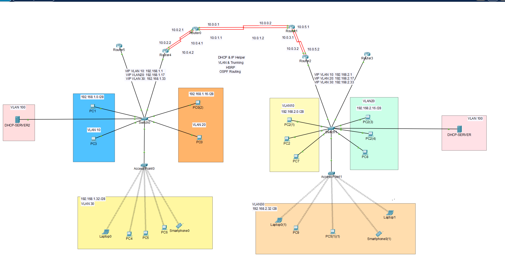

# Multi-Site Enterprise WAN Lab — HSRP & OSPF

A Cisco Packet Tracer lab simulating a two-site enterprise network with redundant gateways, dynamic inter-site routing, and segmented VLANs — reflecting real-world enterprise WAN architecture.

## Overview

This project implements a two-site enterprise topology emphasizing high availability, structured network segmentation, and centralized routing. It applies core enterprise networking concepts — first-hop redundancy, dynamic routing, and VLAN design — within a single, coherent architecture.

## Topology

## Key Features

| Feature | Description |
|---|---|
| **HSRP** | Redundant gateway routers at each site provide automatic failover for end devices if the primary gateway fails. |
| **OSPF** | Dynamic routing between sites over point-to-point WAN links. |
| **VLAN Segmentation** | Each site is divided into three VLANs (10, 20, 30) with a consistent addressing scheme. |
| **DHCP Relay (IP Helper)** | Centralized DHCP servers per site, with relay configured across VLANs. |
| **Wireless Access** | Each site includes an Access Point serving laptops, PCs, and smartphones on a dedicated VLAN. |
| **Server Isolation** | DHCP servers are isolated in a dedicated VLAN, separate from user traffic. |

## Addressing Scheme

| Site   | VLAN | Subnet           | Gateway (VIP) |
|--------|------|------------------|----------------|
| Site 1 | 10   | 192.168.1.0/28   | 192.168.1.1    |
| Site 1 | 20   | 192.168.1.16/28  | 192.168.1.17   |
| Site 1 | 30   | 192.168.1.32/28  | 192.168.1.33   |
| Site 2 | 10   | 192.168.2.0/28   | 192.168.2.1    |
| Site 2 | 20   | 192.168.2.16/28  | 192.168.2.17   |
| Site 2 | 30   | 192.168.2.32/28  | 192.168.2.33   |

Sites are interconnected via redundant WAN links between the core routers, with OSPF managing inter-site routing.

## Planned Improvements

- HSRP and OSPF authentication (MD5) to prevent spoofing
- Port security on access-layer switch ports
- WPA2 encryption on wireless access points
- Secondary DHCP relay target per site for redundancy

## Tools

- Cisco Packet Tracer

## Getting Started

1. Download the `.pkt` file from this repository.
2. Open it in [Cisco Packet Tracer](https://www.netacad.com/courses/packet-tracer) (free with a Cisco Networking Academy account).

## Author

**Abdulaziz Difallah Asiri**
[LinkedIn](https://linkedin.com/in/eng-abdulaziz-asiri)
